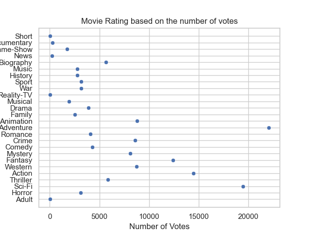
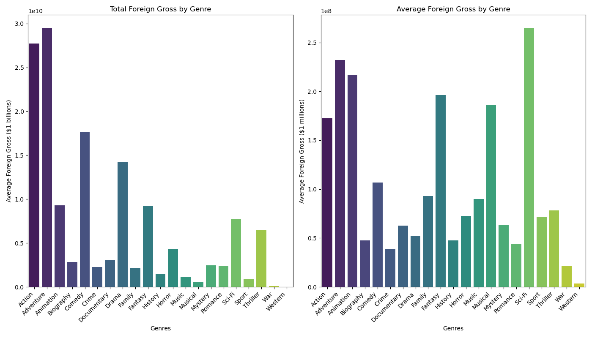

# dsc-project2-movie-studio

## Movie Genre Analysis
### Overview

This project aims to analyze movie genres to provide actionable insights for a new movie studio. By understanding which genres perform the best both domestically and internationally, the studio can make informed decisions about the types of films to produce. The analysis focuses on key performance metrics such as average ratings, number of votes, and gross revenues to identify the most profitable and popular genres.

### Analysis Goals

    Identify the most profitable movie genres based on domestic and foreign gross revenues.
    Understand the distribution of average ratings and number of votes for different genres.
    Provide recommendations on which genres the new movie studio should focus on.

### Methodology

    Data Collection: Gathered data on movies, including genres, average ratings, number of votes, and gross revenues.
    Data Cleaning: Removed outliers and handled missing values to ensure data quality.
    Exploratory Data Analysis:
        Generated visualizations to understand the distribution of average ratings and number of votes by genre.
        Analyzed the total and average gross revenues for each genre.
    Statistical Analysis: Calculated key statistics (mean, median, mode, standard deviation, and variance) for ratings and votes by genre.
    Visualization: Created boxplots, scatter plots, and bar charts to visualize the data and highlight key findings.
    Recommendations: Based on the findings, provided strategic recommendations for the new movie studio.

### Results

#### Key Findings

    Distribution of Movie Ratings:
        Most movies have average ratings between 5 and 7.
        The distribution is approximately normal, indicating a typical spread of movie ratings.

    Foreign Gross by Genre:
        Total Foreign Gross: Drama and Comedy genres have the highest total foreign gross.
        Average Foreign Gross: Westerns have the highest average foreign gross, indicating high profitability per film.

    Domestic Gross by Genre:
        Total Domestic Gross: Drama leads with the highest total domestic gross.
        Average Domestic Gross: Westerns and Music genres show the highest average domestic gross per film.

#### Visualizations

    Distribution of Movie Ratings: Shows the frequency of average ratings across all movies.

    
    Foreign Gross by Genre: Compares total and average foreign gross revenues for different genres.

    Domestic Gross by Genre: Highlights the top genres by total and average domestic gross revenues.

#### Recommendations

    Drama: Invest in high-quality drama films due to their broad appeal and high total gross revenues.
    Comedy: Produce comedy films to leverage their wide audience appeal and high profitability.
    Western: Focus on Westerns for their high average gross per film, ensuring niche market profitability.

#### Contributor

    Orangel Mendez: omendez30@gmail.com

Tableau Dashboard

[Movie Dashboard](https://public.tableau.com/app/profile/orangel.mendez/viz/Movie_analysis_17228284132480/Dashboard1?publish=yes)

Usage

To reproduce the analysis and visualizations, follow these steps:

    Ensure you have the necessary Python packages installed: pandas, seaborn, matplotlib, and numpy.
    Load the dataset and run the analysis script provided in this repository.
    Visualize the results using the provided code or Tableau dashboard link.